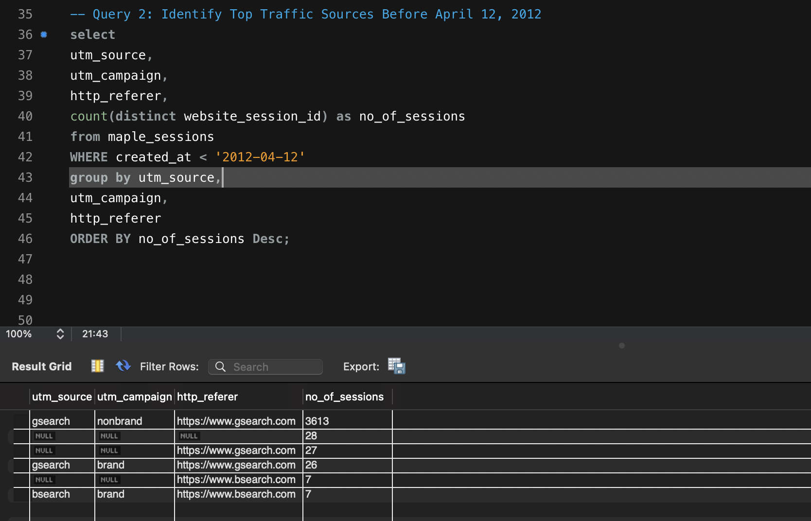
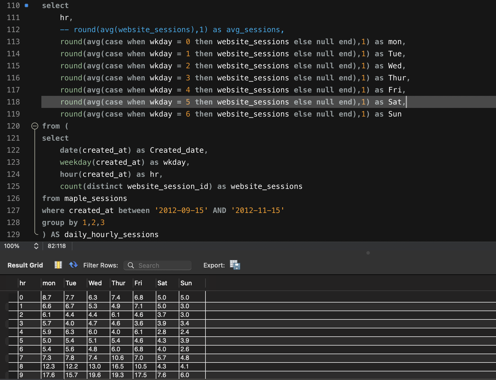
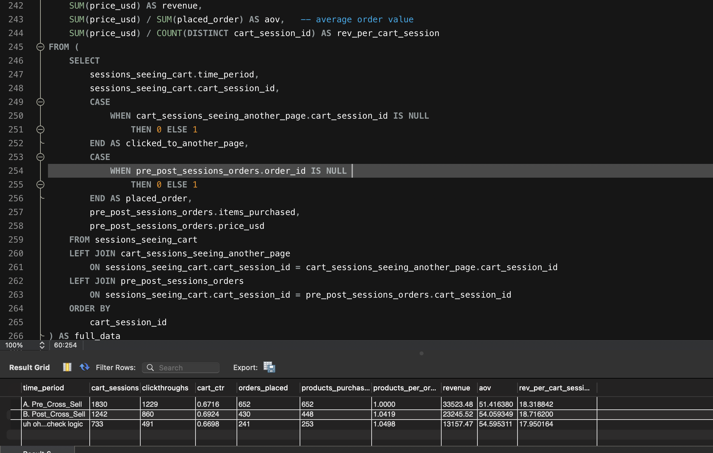
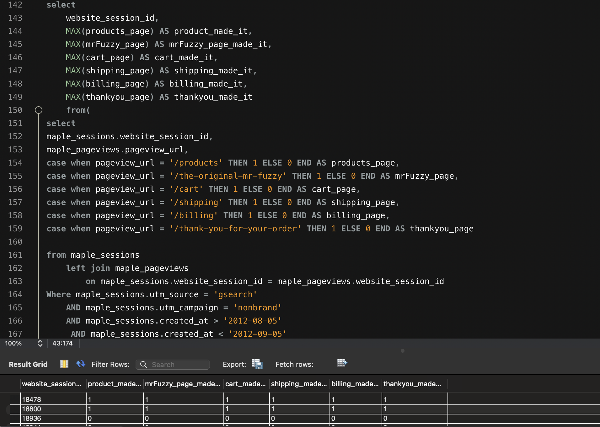

# MapleCart E-Commerce Analytics

## Overview
MapleCart is a simulated e-commerce analytics project designed to analyze customer behavior, traffic acquisition, product performance, and conversion funnels using SQL.

The project demonstrates end-to-end analytical thinking — from identifying acquisition channels to evaluating user engagement, monetization, and conversion efficiency.

---

## Data & Tools
- SQL (MySQL-style syntax)
- Relational database modeling
- Funnel and cohort analysis
- Traffic and conversion analysis
- Entity Relationship Diagram (ERD)

---

## Traffic Sources Analysis

### 1. Traffic Acquisition Overview (Pre-Optimization)

**Objective**  
Identify the dominant traffic sources before optimization efforts.

**Key Insights**
- Google Search (nonbrand) was the primary driver of traffic volume
- Brand and Bing traffic contributed minimal sessions
- NULL referrers likely represent direct traffic or incomplete UTM tagging

**Business Takeaway**  
Marketing investment was heavily concentrated in nonbrand paid search, indicating an opportunity to improve attribution hygiene and diversify acquisition channels.

---

### 2. Gsearch Nonbrand Traffic Trend Analysis

**Objective**  
Analyze weekly session trends for Gsearch nonbrand traffic, comparing desktop and mobile performance to measure the impact of bid changes.

**Key Insights**
- Desktop sessions increased sharply following the bid increase on **2012-05-19**
- Mobile sessions remained relatively stable during the same period
- Bid adjustments primarily affected desktop visibility and traffic volume

**Business Takeaway**  
Bid increases were effective for desktop acquisition but did not significantly impact mobile traffic, suggesting platform-specific optimization strategies.

---

## Channel Portfolio Analysis

**Objective**  
Understand user engagement patterns by hour of day and weekday.

**Key Insights**
- Traffic peaks during weekday business hours
- Weekends show significantly lower engagement
- Session volume increases during mid-day hours

**Business Takeaway**  
Campaign scheduling and budget allocation can be optimized by focusing on high-engagement weekday time windows.

---

## Product Analysis (Cross-Sell Evaluation)

**Objective**  
Evaluate the impact of cross-sell implementation on cart behavior and revenue performance.

**Key Insights**
- Cross-sell increased cart engagement
- Revenue per cart session remained stable
- Average order value showed a slight increase post-implementation

**Business Takeaway**  
Cross-sell features improved user interaction without negatively affecting conversion efficiency, supporting further experimentation.

---

## Website Performance & Funnel Analysis

**Objective**  
Analyze the end-to-end conversion funnel to identify drop-off points.

**Key Insights**
- Strong progression from product to cart pages
- Significant drop-offs at shipping and billing stages
- Checkout experience presents a key optimization opportunity

**Business Takeaway**  
Reducing friction in shipping and billing steps could materially improve overall conversion rates.

---

## Repository Structure

MapleCart-Ecommerce-Analytics/
├── README.md
├── sql/
│   ├── 01_Traffic_Sources_Analysis.sql
│   ├── Analyzing_Traffic_Sources.sql
│   ├── channel_portfolio_analysis.sql
│   ├── Product_Analysis.sql
│   ├── User_Analysis.sql
│   └── Website_performance.sql
└── images/
└── queries/
├── traffic_sources_query.png
├── traffic_sources_Analysis_query.png
├── channel_portfolio_query.png
├── product_analysis_query.png
└── website_performance_query.png

---

## Author
**Meshack Oniera**  
Data Analyst | SQL | Analytics | Power BI  

GitHub: https://github.com/keno1278  
LinkedIn: https://linkedin.com/in/meshackoniera
